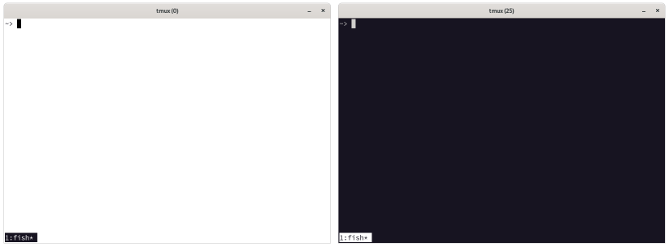

My [st](http://st.suckless.org/) config
=======================================



Customizations
--------------

* Don't show bold text in bright colors (because GNOME Terminal doesn't by default)
* Use [Source Code Pro](http://adobe-fonts.github.io/source-code-pro/) as the default font,
  with fallbacks in case you don't have it installed.  
  (Source Code Pro is the [default monospaced font in GNOME](https://gitlab.gnome.org/GNOME/gsettings-desktop-schemas/-/issues/2) as of early 2019.)
* Use tmux as the default shell
* GNOME Terminal's color palette ported from GNOME 3.38 (both light and dark themes)
* Custom keyboard shortcuts (see below)
* GNOME desktop integration (`.desktop` file)

Installation
------------

### Ubuntu 20.04

* Enable Ubuntu's "Community-maintained free and open-source
  software (universe)" option in the **Software & Updates** app.

* Install [tmux](https://github.com/seanh/tmux/), my `config.h` configures st
  to use tmux. (FIXME: Only use tmux if it's installed.)

Then:

```terminal
sudo apt install --yes git
git clone 'https://github.com/seanh/st.git' ~/.st
~/.st/install
```

To use the dark theme instead of light:

```terminal
~/.st/install --dark
```

Then run `st`, and see `man st`.

Keyboard Shortcuts
------------------

<kbd><kbd>Ctrl</kbd> + <kbd>=</kbd></kbd> increase font size.

<kbd><kbd>Ctrl</kbd> + <kbd>-</kbd></kbd> decrease font size.

<kbd><kbd>Ctrl</kbd> + <kbd>0</kbd></kbd> reset font size.

Not changed from st's defaults:

<kbd><kbd>Ctrl</kbd> + <kbd>Shift</kbd> + <kbd>c</kbd></kbd> Copy the selected text to the clipboard.

<kbd><kbd>Ctrl</kbd> + <kbd>Shift</kbd> + <kbd>v</kbd></kbd> Paste from the clipboard.

<kbd><kbd>Ctrl</kbd> + <kbd>Shift</kbd> + <kbd>y</kbd></kbd> or middle mouse button: paste from primary selection.
